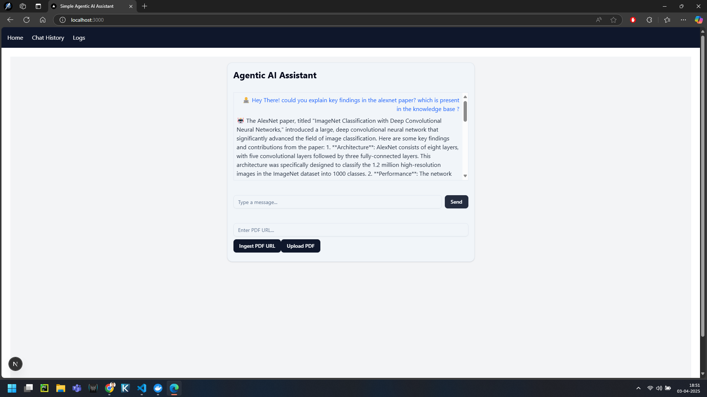
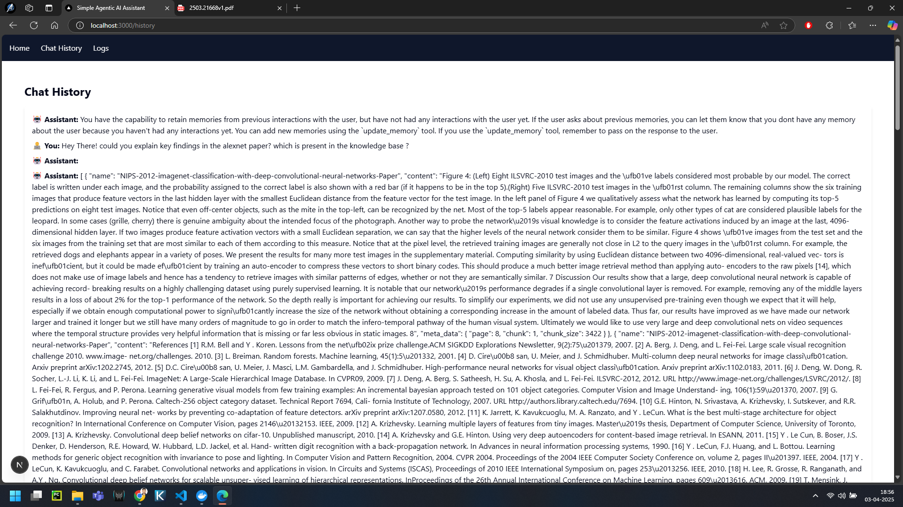
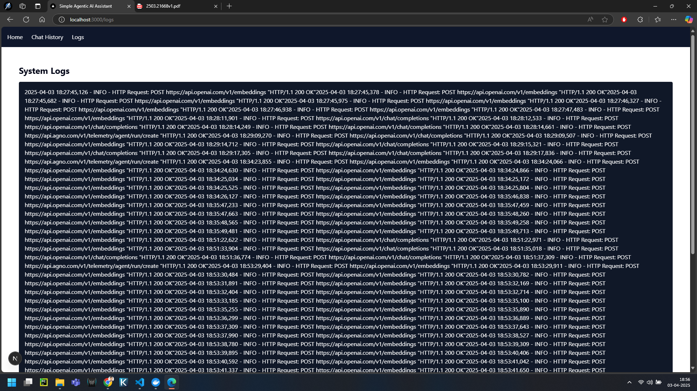

# 🧠 Simple Agentic AI Assistant (PDF-based RAG Chatbot)

This is a full-stack AI assistant that uses Retrieval-Augmented Generation (RAG) to enable conversations grounded in PDF documents. It supports both **URL-based** and **file-based** PDF ingestion, persistent chat history, and system logs.

## ✨ Features

- Chat interface powered by OpenAI GPT-4o.
- RAG using PDF documents (from file upload or URL).
- Vector search with PgVector and PostgreSQL.
- Persistent session memory with `PostgresAgentStorage`.
- Display chat history per session.
- View system logs from the backend.
- Clean UI with Next.js, TailwindCSS, Axios.

## 🖼️ Frontend Stack

- [Next.js 15+](https://nextjs.org/)
- [TailwindCSS](https://tailwindcss.com/)
- [Axios](https://axios-http.com/)
- TypeScript, React, ShadCN UI

## 🧠 Backend Stack

- [FastAPI](https://fastapi.tiangolo.com/)
- [Agno](https://docs.agno.com/introduction)
- [PgVector](https://github.com/pgvector/pgvector)
- PostgreSQL (vector DB + memory DB)
- dotenv, logging


## ⚙️ Setup Instructions

### 1. Clone and Setup Backend

```bash
cd backend
python3 -m venv venv
source venv/bin/activate
pip install -r requirements.txt
uvicorn app.main:app --reload --host 0.0.0.0 --port 8000
```

Ensure you have a working PostgreSQL instance and `pgvector` installed.
Use OpenAI api key in agentic-ai/simple_agentic_ai/backend/.env 
### 2. Clone and Setup Frontend

```bash
cd frontend
npm install
npm run dev
```

Access frontend at: [http://localhost:3000](http://localhost:3000)

## 🧪 API Endpoints

| Method | Endpoint             | Description                    |
|--------|----------------------|--------------------------------|
| POST   | `/api/chat`          | Chat with the assistant        |
| POST   | `/api/ingest/url`    | Ingest PDF from URL            |
| POST   | `/api/ingest/upload` | Upload local PDF               |
| GET    | `/api/history`       | Fetch session chat history     |
| GET    | `/api/logs`          | View system logs (last 100)    |

## 💡 Example Prompt

```
What is this document about?
Summarize key points in bullet format.
```

## 📌 Notes

- All uploaded PDFs go to `backend/data/pdfs/`.
- PDF ingestion updates the agent's knowledge in real time.
- Session ID defaults to `"user"` unless explicitly set.
### Images 



---

📬 Contact:
----------------------------------------------------
Sai Teja  
Email: saiteja.cse.rymec@gmail.com  
LinkedIn: https://www.linkedin.com/in/sai-teja-narra-venkata-75265a249/

⭐ Star This Project:
----------------------------------------------------
If you find this project useful, please give it a ⭐ on GitHub!
